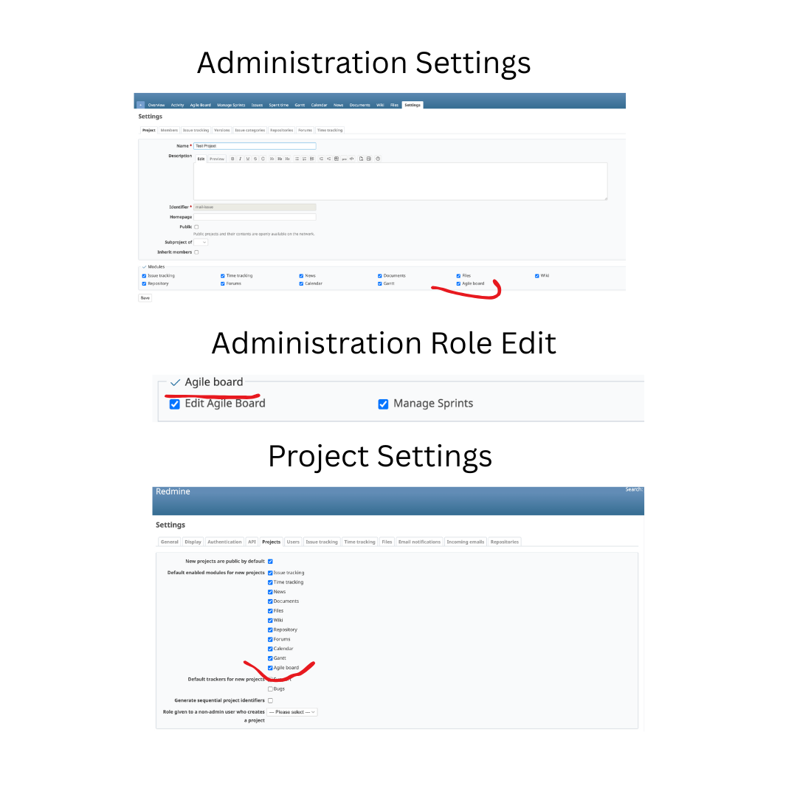
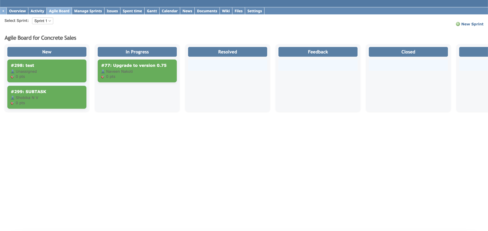
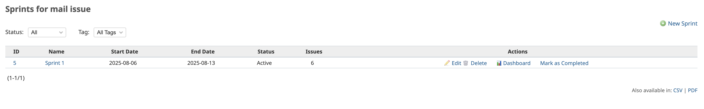
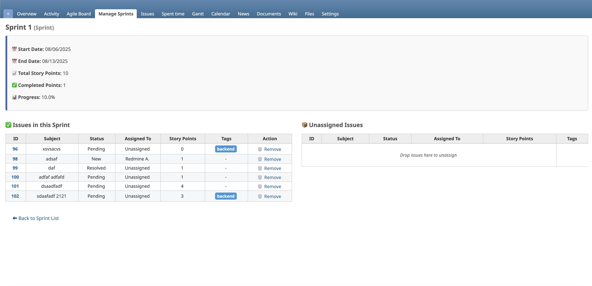
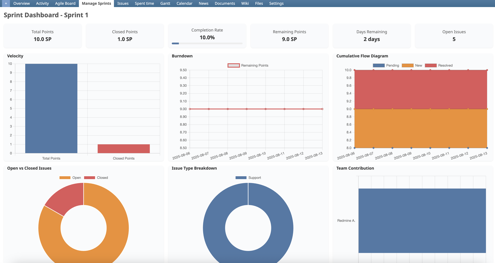

# 🧩 Redmine Sprint Board Pro

`redmine_sprint_board_pro` is a powerful plugin for Redmine that brings Agile project management features like Sprint Planning, Trello-style Agile Boards, Burndown Charts, Smart Backlog Suggestions, and more.

---

## ✨ Features

- 🗂 Sprint CRUD (Create, Edit, Complete, Delete)
- 📋 Agile Board (Drag & Drop Kanban view)
- 🎯 Story Points and Sprint Assignment
- 🏷 **Tags for Issues** (with color coding & autocomplete)
- 🔍 **Tag Filters in Sprints**
- 🔄 **Sprint Spillover** (JIRA-like task movement to next sprint)
- 📉 Burndown & Velocity Charts
- 🧠 Smart Backlog Suggestions (AI-assisted)
- 🎨 Card Color Coding (e.g., based on priority)
- 🪄 Optional Swimlanes (group by assignee, tracker, etc.)
- 🧾 Export formats: CSV, PDF for Sprint list
- 📧 Email Notifications
---

## 🛠 Installation

1. **Clone the plugin inside Redmine plugins directory**

```bash
cd /path/to/redmine/plugins
git clone https://github.com/railsfactory-sivamanikandan/redmine_sprint_board_pro.git
```

## Install dependencies

```bash
bundle install
```

## Run migrations

```bash
bundle exec rake redmine:plugins:migrate NAME=redmine_sprint_board_pro RAILS_ENV=production
```

## 🏷 Tags Support
### Enable Tags
We use acts-as-taggable-on to manage tags.

- Tags can be added when creating or editing an Issue.
- Multiple tags are supported via an autocomplete multi-select.
- Tags are displayed on Issue cards in the Agile Board and Sprint pages.
- Each tag is color-coded for better visual separation.

### Tag Filters
- Sprints Page: Filter sprints by tags applied to their issues.
- Agile Board: Filter visible issues by tags without reloading the entire board. (coming soon)

## 🔄 Sprint Spillover

Sprint Spillover is a JIRA-like feature that allows you to easily move incomplete tasks from one sprint to the next, streamlining your sprint planning process.

### ✨ Key Features
- **Smart Detection**: Automatically identifies incomplete tasks in the current sprint
- **Next Sprint Integration**: Finds the chronologically next available sprint
- **Bulk & Selective Options**: Move all incomplete tasks or select specific ones
- **Visual Indicators**: Shows count of incomplete tasks and target sprint
- **Permission-Based**: Respects Redmine's permission system (`edit_agile_board`)

### 🎯 How It Works

#### Agile Board View
- Select a sprint from the dropdown
- If there are incomplete tasks and a next sprint exists, spillover controls appear
- **"Move to [Next Sprint]"**: Bulk move all incomplete tasks
- **"Select Tasks"**: Choose specific tasks to move via modal dialog

#### Sprint Show Page
- View any sprint detail page
- Spillover section appears in the sprint summary (if applicable)
- Same bulk and selective movement options available
- Clean breadcrumb navigation for easy sprint browsing

### 🔧 Technical Details
- **Backend**: Robust sprint model with `spillover_to_next_sprint()` method
- **Frontend**: Modern modal interface with SVG icons and responsive design
- **Permissions**: Uses existing `edit_agile_board` permission
- **Validation**: Confirms actions with user before moving tasks
- **Feedback**: Success notifications and error handling

### 📋 Usage Examples

1. **End of Sprint**: Quickly move unfinished user stories to the next sprint
2. **Sprint Planning**: Clean up previous sprint while planning the next one
3. **Backlog Management**: Efficiently redistribute work across upcoming sprints

### 💡 Benefits
- **Time Saving**: No manual task reassignment needed
- **Consistency**: Maintains sprint continuity and planning accuracy
- **User Experience**: Familiar JIRA-like workflow for Agile teams
- **Flexibility**: Choose between bulk moves or granular task selection

## 📚 Usage
- Go to your project → Agile Board
- Select/Create a Sprint
- Drag & drop issues across status columns
- Create or edit a Sprint with smart issue suggestions
- Use spillover controls to move incomplete tasks to next sprint
- Use the charts tab for burndown/velocity metrics
### Charts & Metrics

- 📈 **Cumulative Flow Diagram (CFD)**
  Track the number of issues in each workflow state over time to identify bottlenecks.

- 🚀 **Velocity Chart**
  See how many story points (or issues) your team completes each sprint.

- 📉 **Burndown Chart**
  Monitor remaining work vs. time to ensure you're on track.

- 🔍 **Open vs. Closed Issues**
  Compare counts of open and completed issues within the sprint.

- 🗂 **Issue Type Breakdown**
  Visualize the distribution of Bugs, Features, Tasks, etc., in your sprint.

- 👥 **Team Contribution**
  See who’s contributing the most in terms of issues completed or story points delivered.


### Benefits
- **Early risk detection**: Spot workflow bottlenecks from the CFD.
- **Team performance insights**: Use Velocity and Contribution charts to plan future sprints.
- **Balanced workload**: Monitor open vs. closed issues daily.


## 🔐 Permissions
The plugin adds the following permissions:

- View agile board
- Manage sprints
- View agile charts

Configure them under:
Admin → Settings → Project → Agile board

## 🎨 Customization

- Card Colors: Priority-based color classes (configured via CSS)
- Drag-and-Drop: Customizable via agile_board.js
- Smart Suggestions: You can plug in your own AI/ML logic

## 📧 Email Notifications

The plugin now supports two types of automated email notifications:

- 1 Sprint Completed Notification
  - When it triggers: Immediately after a sprint is marked as completed.
  - Recipients: The project manager (must have the "Manager" role and a valid email).
  - Content:
    - Sprint name and project name
    - Sprint start & end dates
    - Key metrics (velocity, closed/open points, open issues)
    - Link to the Sprint Dashboard

Enable/Disable:
  - 1 Go to Administration → Plugins → Sprint Board Pro → Configure.
  - 2 Set "Notify on sprint completed" to Enabled (1).

## 2 Monthly Sprint Report
  - When it triggers: Automatically at the end of each month (via a rake task or scheduled job).
  - Recipients: The project manager (must have the "Manager" role and a valid email).
  - Content:
    - Reporting period (1st → last day of the month)
    - Sprint counts (total, completed, open)
    - Issues resolved
    - Closed issues
    - Story points completed
    - Link to the project dashboard

Enable/Disable:
  - 1 Go to Administration → Plugins → Sprint Board Pro → Configure.
  - 2 Set "Monthly report enabled" to Enabled (1).

## ⚙️ Setup & Usage

- 1 Ensure Email Settings
  - In Administration → Settings → Email notifications, make sure:
    - Host name and protocol is set under Administration → Settings → General.
    - SMTP settings are correctly configured in config/configuration.yml or via environment variables.
    - Setting.mail_from is set (default: redmine@example.net).

- 2 Rake Task for Monthly Report
Add this rake task to your cron to run at the end of each month:

```bash
# Example: run at 23:59 on the last day of each month
59 23 28-31 * * [ "$(date +\%d -d tomorrow)" == "01" ] && cd /path/to/redmine && RAILS_ENV=production bundle exec rake sprint_board_pro:monthly_report
```

## 🔍 Notes

- Manager detection: The plugin finds the first project member with the role “Manager” and sends them the report.
- ActiveJob support: Emails are sent using deliver_later if async queue is enabled, otherwise deliver_now.
- Letter Opener support: In development, you can use letter_opener to preview emails locally.


## 🔄 Supported Redmine Versions

- ✅ Redmine 4.x and 5.x
- ✅ Ruby 2.6+ to 3.3+
- ✅ Rails 5.2 to 6.1

## 📦 Export Formats
Available on the Sprint listing page:

- CSV Export
- PDF Export

## 🚧 Development
To start developing:

```bash
bundle exec rails server
```

## Here is a screenshot of the plugin:












## 💡 Roadmap

- Filter issues by tracker/user in board
- Add WIP limits per column
- Add in-place editing for cards
- Add REST API support
- Batch operations for multiple sprints
- Advanced spillover rules and automation

## 📄 License
MIT License.

## 🙌 Credits
Built with ❤️ by sivamanikandan.

Inspired by RedmineUP Agile Plugin and the Redmine community.

```yaml

---

Would you like me to include a badge section (e.g., version, downloads, build status), or generate a basic `gemspec` or plugin `.rb` stub too?
```